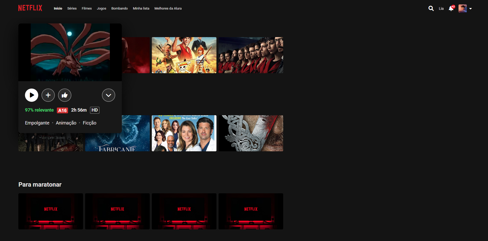

# Netlura - Projeto de Catálogo Front-end

Este repositório contém um projeto de interface web, ideal para portfólio de transição de carreira para programação. O projeto demonstra organização de HTML/CSS/JS com componentes, layout responsivo e interface dinâmica.

## 🧩 O que o projeto faz

- Página inicial (`index.html`) com estilo e suporte a tema (`theme.js`).
- Página de catálogo (`catalogo/catalogo.html`) exibe produtos-serviços usando dados de `catalogo/js/data.js`.
- `catalogo/js/main.js` implementa renderização dinâmica, busca e filtro.
- `catalogo/js/utils.js` contém funções auxiliares de DOM/formatos.
- Componente de cartão (`catalogo/js/components/Card.js`) e carrossel (`catalogo/js/components/Carousel.js`).

## 🗂 Estrutura do projeto

- `index.html`, `style.css`, `theme.js`: página inicial e tema
- `catalogo/catalogo.html`, `catalogo/catalogo.css`: página de catálogo
- `catalogo/js/`: dados (`data.js`), lógica (`main.js`), utilitários (`utils.js`)
- `catalogo/js/components/`: componentes `Card` e `Carousel`

## ▶️ Como rodar

Opções:
- Abrir `index.html` ou `catalogo/catalogo.html` diretamente no navegador
- Ou servir localmente com:
  - `npx serve .`
  - `python -m http.server`

> Não há dependências externas; ambiente mínimo apenas navegador moderno.

## 📷 Screenshots

## 🎯 Pontos de destaque

- Uso de JavaScript puro moderno (ES6+).
- Organização modular e componentes reutilizáveis.
- Exibição de catálogo a partir de dados estáticos.
- Excelente para mostrar desenvolvimento front-end em portfólio.

## 💡 Melhorias futuras

- Adicionar filtros avançados e carrinho de compras.
- Integração com API real (fetch).
- Implementar PWA (offline + cache).
- Deploy em GitHub Pages.
